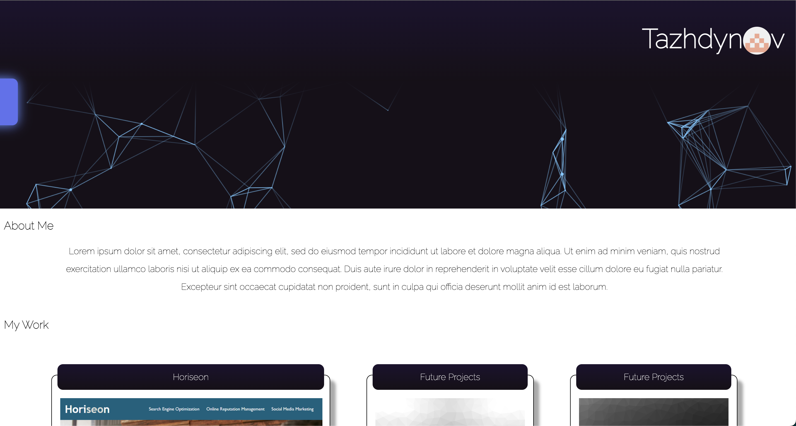
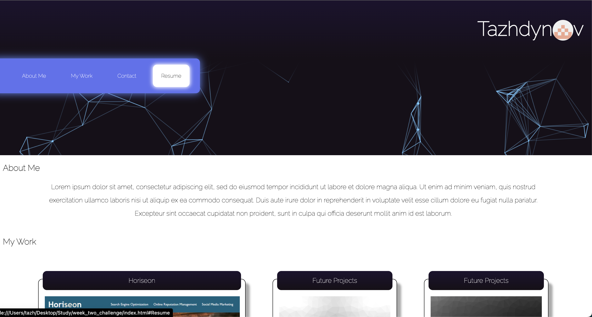
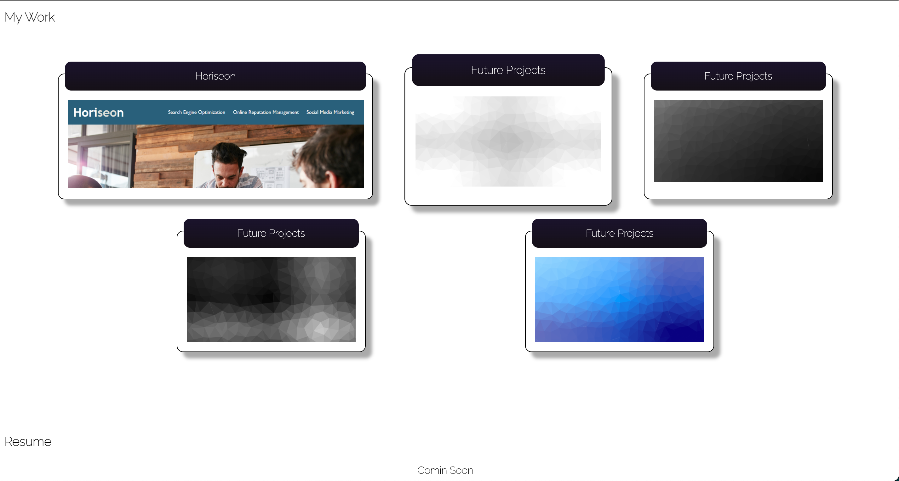

# Responsive-Portfolio

This project was designed as a homework assignment for UNH's coding bootcamp. This emphasizes modifying an exisitng website template build in HTML and CSS to have responsiveness using CSS media queries. 

Layout and content were built using HTML and CSS using Visual Studio Code editor.

This project has been deployed to GitHub Pages. To get this project up and running, you can follow the deployment link. Or, download the sources files to use this as a template.

* [GitHub Repository](https://github.com/tajdinov/week_two_challenge)
* [Deployed GitHub IO](https://tajdinov.github.io/week_two_challenge/)

### Installing

To install this code, download the zip file, or use GitHub's guidelines to clone the repository. 

## Project Requirements 

This project provides a responsive template for a portfolio website. 

### Summary
* This project emphasizes the use of repsonsive design using CSS Media Queries 

    
    
    

### To Execute File:
> Open in browser

### Features: 
* HTML Page
    * Index.html
        * Contains personal bio
* Two CSS Pages
    * Styles.css
        * Main styles sheet
    * Reset.css 
        * Clears default browser styling
